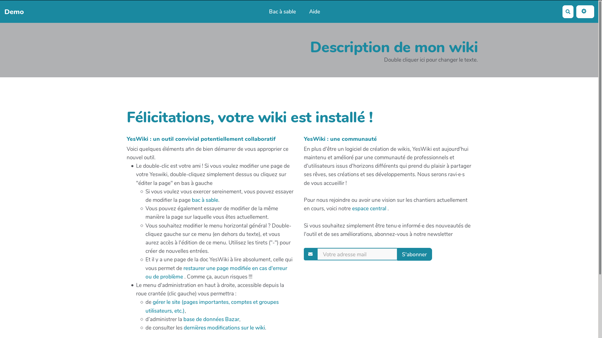

<!--
NB: Deze README is automatisch gegenereerd door <https://github.com/YunoHost/apps/tree/master/tools/readme_generator>
Hij mag NIET handmatig aangepast worden.
-->

# YesWiki voor Yunohost

[](https://ci-apps.yunohost.org/ci/apps/yeswiki/)


[](https://install-app.yunohost.org/?app=yeswiki)

*[Deze README in een andere taal lezen.](./ALL_README.md)*

> *Met dit pakket kun je YesWiki snel en eenvoudig op een YunoHost-server installeren.*  
> *Als je nog geen YunoHost hebt, lees dan [de installatiehandleiding](https://yunohost.org/install), om te zien hoe je 'm installeert.*

## Overzicht

YesWiki is a wiki designed to remain simple, very easy to install, in French translated into English, Spanish, Catalan, Flemish...

However, with a YesWiki we can build a website with multiple uses:
- Gather all the information of a project or a group (function of "central station")
- Mapping members or places in a participatory way
- Share resources, lists, calendars thanks to powerful cooperative databases
- Communicate information flows
- Cultivate a bit of freedom...


**Geleverde versie:** 4.5.0~ynh1

**Demo:** <https://ferme.yeswiki.net/?CreerSonWiki>

## Schermafdrukken



## Documentatie en bronnen

- Officiele website van de app: <https://yeswiki.net/>
- Officiele beheerdersdocumentatie: <https://yeswiki.net/?doc>
- Upstream app codedepot: <https://github.com/YesWiki/yeswiki>
- YunoHost-store: <https://apps.yunohost.org/app/yeswiki>
- Meld een bug: <https://github.com/YunoHost-Apps/yeswiki_ynh/issues>

## Ontwikkelaarsinformatie

Stuur je pull request alsjeblieft naar de [`testing`-branch](https://github.com/YunoHost-Apps/yeswiki_ynh/tree/testing).

Om de `testing`-branch uit te proberen, ga als volgt te werk:

```bash
sudo yunohost app install https://github.com/YunoHost-Apps/yeswiki_ynh/tree/testing --debug
of
sudo yunohost app upgrade yeswiki -u https://github.com/YunoHost-Apps/yeswiki_ynh/tree/testing --debug
```

**Verdere informatie over app-packaging:** <https://yunohost.org/packaging_apps>
